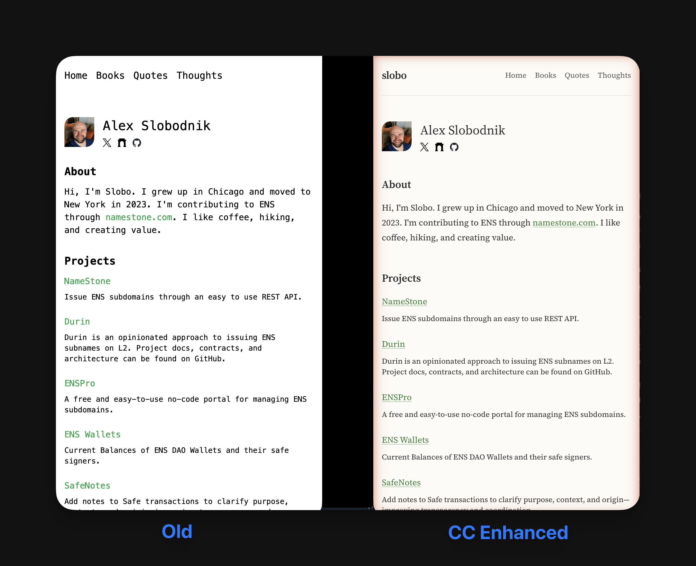

# slobo.xyz Redesign

Built the original site myself in 2023. Redesigned in January 2026 using Claude Code with the frontend-design skill.

**Time: ~25 minutes** from first prompt to deployed.

## What Changed

- **Typography:** Source Serif 4 (body) + JetBrains Mono (code)
- **Colors:** Cream background (#FDFBF7), earthy green (#2E7D32)
- **Nav:** "slobo" wordmark left, links right
- **Details:** Fade-in animation, card hover lift, subtle link underlines
